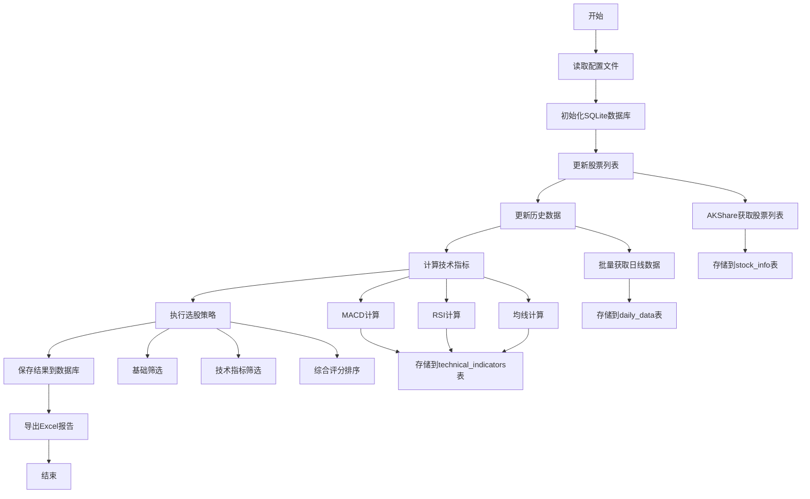

# 短线选股工具开发计划

## 项目概述
开发一个基于Python的短线选股工具，用于A股市场的短线交易策略筛选。

## 技术架构
- **编程语言**: Python 3.x
- **数据源**: AKShare (已安装)
- **数据库**: SQLite (轻量级本地数据库)
- **数据处理**: pandas, numpy
- **技术指标**: talib 或自定义计算
- **输出格式**: Excel (openpyxl)

## 开发阶段

### 阶段一：数据获取与存储模块 (data_fetcher.py + database.py)
**目标**: 建立稳定的数据获取和本地存储基础

#### 功能需求:
1. **SQLite数据库设计**
   - 股票基本信息表 (stock_info)
   - 日线数据表 (daily_data)
   - 技术指标表 (technical_indicators)
   - 选股结果表 (selection_results)

2. **A股股票列表获取**
   - 获取沪深A股完整股票列表
   - 过滤ST、退市等特殊股票
   - 存储到SQLite数据库

3. **历史数据获取**
   - 日线数据：开盘价、收盘价、最高价、最低价、成交量、成交额
   - 数据时间范围：可配置（默认最近60个交易日）
   - 增量更新机制，避免重复获取

#### 数据库表结构:
```sql
-- 股票基本信息表
CREATE TABLE stock_info (
    symbol TEXT PRIMARY KEY,
    name TEXT NOT NULL,
    industry TEXT,
    market TEXT,
    list_date DATE,
    updated_at TIMESTAMP DEFAULT CURRENT_TIMESTAMP
);

-- 日线数据表
CREATE TABLE daily_data (
    id INTEGER PRIMARY KEY AUTOINCREMENT,
    symbol TEXT NOT NULL,
    date DATE NOT NULL,
    open REAL,
    high REAL,
    low REAL,
    close REAL,
    volume INTEGER,
    amount REAL,
    turnover_rate REAL,
    created_at TIMESTAMP DEFAULT CURRENT_TIMESTAMP,
    UNIQUE(symbol, date)
);

-- 技术指标表
CREATE TABLE technical_indicators (
    id INTEGER PRIMARY KEY AUTOINCREMENT,
    symbol TEXT NOT NULL,
    date DATE NOT NULL,
    macd REAL,
    macd_signal REAL,
    macd_histogram REAL,
    rsi REAL,
    ma5 REAL,
    ma10 REAL,
    ma20 REAL,
    ma60 REAL,
    volume_ratio REAL,
    created_at TIMESTAMP DEFAULT CURRENT_TIMESTAMP,
    UNIQUE(symbol, date)
);

-- 选股结果表
CREATE TABLE selection_results (
    id INTEGER PRIMARY KEY AUTOINCREMENT,
    symbol TEXT NOT NULL,
    name TEXT,
    date DATE NOT NULL,
    price_change REAL,
    volume_ratio REAL,
    turnover_rate REAL,
    macd_signal TEXT,
    rsi_signal TEXT,
    ma_signal TEXT,
    total_score REAL,
    created_at TIMESTAMP DEFAULT CURRENT_TIMESTAMP
);
```

#### 技术实现:
```python
# 主要函数设计
class DatabaseManager:
    def __init__(self, db_path: str)
    def create_tables(self)
    def insert_stock_info(self, stock_data: pd.DataFrame)
    def insert_daily_data(self, symbol: str, data: pd.DataFrame)
    def get_stock_list(self) -> pd.DataFrame
    def get_stock_data(self, symbol: str, days: int = 60) -> pd.DataFrame

class DataFetcher:
    def __init__(self, db_manager: DatabaseManager)
    def update_stock_list(self)
    def update_daily_data(self, symbols: list = None)
    def get_latest_data(self, symbol: str) -> pd.DataFrame
```

### 阶段二：选股逻辑模块 (stock_selector.py)
**目标**: 实现多维度的股票筛选逻辑

#### 功能需求:
1. **涨幅榜选股**
   - 日涨幅排序
   - 近N日累计涨幅
   - 可配置涨幅阈值

2. **成交量指标筛选**
   - 量比计算 (当日成交量/近期平均成交量)
   - 换手率计算
   - 成交量突破识别

3. **基础筛选条件**
   - 价格区间过滤
   - 市值范围过滤
   - 流通股本过滤

#### 技术实现:
```python
class StockSelector:
    def __init__(self, db_manager: DatabaseManager)
    def calculate_price_changes(self, days: int = 1) -> pd.DataFrame
    def calculate_volume_metrics(self) -> pd.DataFrame
    def apply_basic_filters(self, criteria: dict) -> list
    def rank_by_performance(self, metric: str, top_n: int = 100) -> list
```

### 阶段三：技术指标模块 (technical_indicators.py)
**目标**: 实现核心技术指标计算和信号识别

#### 功能需求:
1. **MACD指标**
   - MACD线、信号线、柱状图计算
   - 金叉、死叉信号识别
   - MACD背离检测

2. **RSI指标**
   - RSI值计算（默认14日）
   - 超买超卖区间判断
   - RSI背离检测

3. **均线系统**
   - 多周期均线计算（5日、10日、20日、60日）
   - 均线排列判断
   - 均线突破信号

#### 技术实现:
```python
class TechnicalIndicators:
    def __init__(self, db_manager: DatabaseManager)
    def calculate_macd(self, symbol: str) -> pd.DataFrame
    def calculate_rsi(self, symbol: str, period: int = 14) -> pd.Series
    def calculate_moving_averages(self, symbol: str) -> pd.DataFrame
    def detect_signals(self, symbol: str) -> dict
    def batch_calculate_indicators(self, symbols: list)
    def update_indicators_table(self)
```

### 阶段四：运行与输出模块 (output_manager.py)
**目标**: 提供友好的结果展示和数据导出

#### 功能需求:
1. **结果整合**
   - 从数据库查询筛选结果
   - 按优先级排序
   - 添加综合评分

2. **Excel输出**
   - 多工作表结构
   - 格式化显示（颜色标记、条件格式）
   - 图表生成（可选）

3. **历史记录**
   - 选股结果存储到数据库
   - 历史表现跟踪
   - 策略效果分析

#### 技术实现:
```python
class OutputManager:
    def __init__(self, db_manager: DatabaseManager)
    def generate_selection_results(self, criteria: dict) -> pd.DataFrame
    def export_to_excel(self, results: pd.DataFrame, filename: str)
    def save_results_to_db(self, results: pd.DataFrame)
    def generate_performance_report(self, days: int = 30) -> dict
```

### 阶段五：主程序模块 (main.py)
**目标**: 整合所有模块，提供统一的运行入口

#### 功能需求:
1. **配置管理**
   - 参数配置文件
   - 数据库路径配置
   - 运行模式选择

2. **流程控制**
   - 数据更新 → 指标计算 → 股票筛选 → 结果输出
   - 错误处理和重试机制
   - 进度显示

3. **定时任务**
   - 每日数据更新
   - 自动选股运行
   - 结果推送（可选）

## 配置文件设计 (config.yaml)
```yaml
# 数据库配置
database:
  path: "data/stock_data.db"
  backup_enabled: true
  backup_interval: 7  # 天

# 数据获取配置
data:
  period: 60  # 历史数据天数
  update_time: "09:30"  # 每日更新时间
  retry_times: 3
  retry_interval: 5  # 秒

# 筛选条件配置
filters:
  price_range: [5, 100]  # 价格区间
  min_volume_ratio: 1.5  # 最小量比
  min_turnover_rate: 3.0  # 最小换手率
  min_price_change: 2.0  # 最小涨幅%

# 技术指标配置
technical:
  macd:
    fast_period: 12
    slow_period: 26
    signal_period: 9
  rsi:
    period: 14
    overbought: 70
    oversold: 30
  ma_periods: [5, 10, 20, 60]

# 输出配置
output:
  max_results: 50  # 最大输出股票数
  excel_filename: "selected_stocks_{date}.xlsx"
  include_charts: false
  output_dir: "output"
```

## 项目文件结构
```
short_term_stock_selector/
├── main.py                 # 主程序入口
├── config.yaml            # 配置文件
├── database.py            # 数据库管理模块
├── data_fetcher.py        # 数据获取模块
├── stock_selector.py      # 选股逻辑模块
├── technical_indicators.py # 技术指标模块
├── output_manager.py      # 输出管理模块
├── utils.py               # 工具函数
├── requirements.txt       # 依赖包列表
├── data/                  # 数据目录
│   └── stock_data.db      # SQLite数据库文件
├── logs/                  # 日志目录
└── output/                # 输出结果目录
```

## 数据流程图



## SQLite优势
1. **轻量级**: 无需安装额外数据库服务
2. **高性能**: 本地文件访问，查询速度快
3. **可靠性**: ACID事务支持，数据安全
4. **便携性**: 单文件数据库，易于备份和迁移
5. **SQL支持**: 标准SQL语法，易于查询和分析

## 核心算法设计

### 1. 增量数据更新策略
```python
def update_daily_data(self, symbol: str):
    # 获取数据库中最新日期
    last_date = self.get_last_update_date(symbol)
    # 只获取新增数据
    new_data = akshare.stock_zh_a_hist(symbol, start_date=last_date)
    # 插入到数据库
    self.insert_daily_data(symbol, new_data)
```

### 2. 技术指标批量计算
```python
def batch_calculate_indicators(self, symbols: list):
    for symbol in symbols:
        data = self.db.get_stock_data(symbol, 60)
        indicators = self.calculate_all_indicators(data)
        self.db.update_indicators(symbol, indicators)
```

### 3. 综合评分算法
```python
def calculate_score(self, row):
    score = 0
    # 涨幅权重 30%
    score += row['price_change'] * 0.3
    # 量比权重 25%
    score += row['volume_ratio'] * 0.25
    # 技术指标权重 45%
    score += self.technical_score(row) * 0.45
    return score
```

## 性能优化策略

### 1. 数据库优化
- 创建适当的索引
- 使用事务批量插入
- 定期清理历史数据

### 2. 计算优化
- 向量化计算替代循环
- 缓存计算结果
- 并行处理多只股票

### 3. 内存管理
- 分批处理大量数据
- 及时释放不用的数据
- 使用生成器减少内存占用

## 依赖包列表 (requirements.txt)
```
akshare>=1.17.0
pandas>=1.5.0
numpy>=1.24.0
openpyxl>=3.1.0
PyYAML>=6.0
sqlite3  # Python内置
talib>=0.4.0  # 可选，技术指标库
tqdm>=4.65.0  # 进度条
loguru>=0.7.0  # 日志库
```

## 开发时间表

| 阶段 | 预计时间 | 主要任务 |
|------|----------|----------|
| 阶段一 | 3-4天 | 数据库设计、数据获取模块开发 |
| 阶段二 | 2-3天 | 选股逻辑模块开发 |
| 阶段三 | 3-4天 | 技术指标模块开发 |
| 阶段四 | 2-3天 | 输出模块开发 |
| 阶段五 | 1-2天 | 整合测试和优化 |
| **总计** | **11-16天** | **完整系统开发** |

## 测试计划

### 数据库测试
- 表结构创建测试
- 数据插入和查询测试
- 并发访问测试
- 数据完整性测试

### 功能测试
- 数据获取准确性测试
- 技术指标计算验证
- 选股逻辑正确性测试
- Excel输出格式测试

### 性能测试
- 大量数据处理性能
- 数据库查询效率
- 内存使用情况
- 并发处理能力

---

**注意**: 使用SQLite作为本地数据库，既保证了数据的持久化存储，又避免了复杂的数据库配置，非常适合个人使用的量化选股工具。